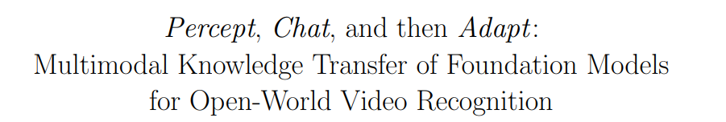
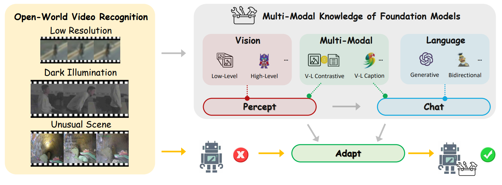
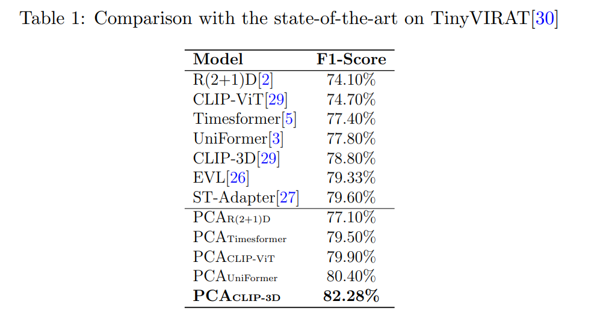
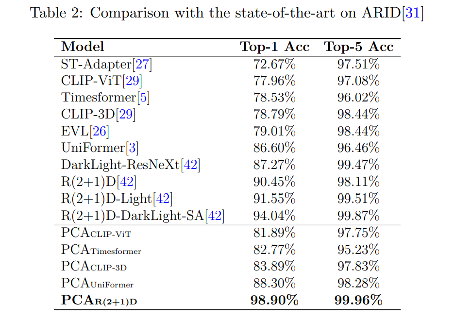
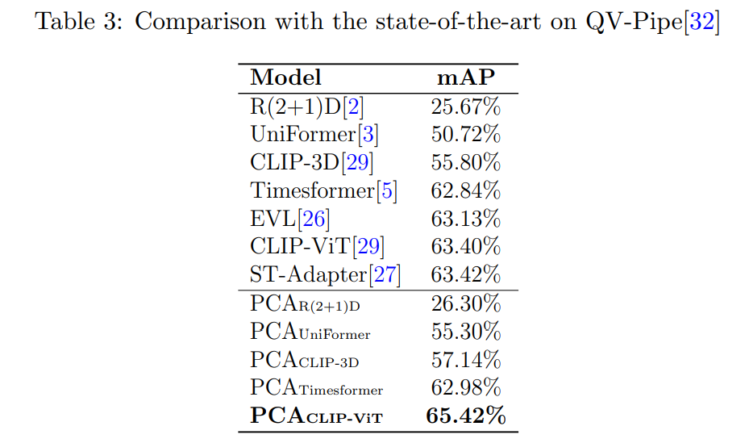
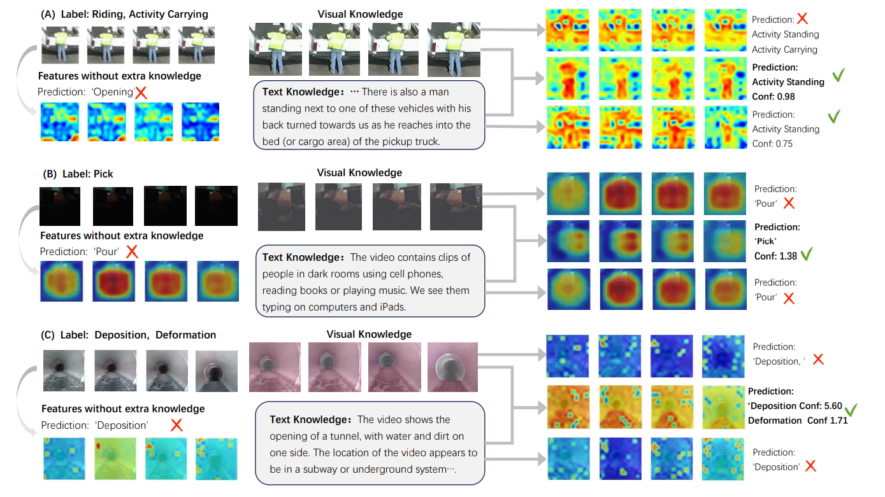

# 


Boyu Chen, Siran Chen, Kunchang Li, Qinglin Xu, [Yu Qiao](https://scholar.google.com/citations?user=gFtI-8QAAAAJ&hl), [Yali Wang†](https://scholar.google.com/citations?user=hD948dkAAAAJ)

Video recognition is challenging for realistic scenarios in the open world, since traditional video networks are not
generalized well on complex environment variations. Alternatively, foundation models have recently shown their generalization power, with rich knowledge learned from web-scale pretraining. However, how to apply such knowledge has not been fully explored for open-world video recognition. 

To this end, we propose a generic knowledge transfer pipeline in this work, which treats the set of foundation models as a knowledge container, and progressively exploits and integrates external multimodal knowledge to boost open-world video recognition. We name it as **PCA**, based on three cascade stages of **P**ercept, **C**hat and **A**dapt. 

First, we enhance open-world videos to reduce domain gap in the Percept stage, and then extract visual features of
enhanced videos as external visual knowledge. Second, we further generate rich linguistic semantics about predicted labels or video captions, via vision-language understanding in the Chat stage. These diversified texts are used as external textual knowledge to describe videos in details. Finally, we blend external visual and textual knowledge in the Adapt stage, by flexibly inserting a multimodal knowledge adaptation module into video backbones for open-world recognition. 

To verify the effectiveness of our PCA, we conduct extensive experiments on three challenging video benchmarks in the open world, i.e., low-resolution TinyVIRAT, dark-illumination ARID, and unusual-domain QV-Pipe. The results show that, our approach achieves the state-of-the-art performance on all these three datasets.



## Results

### TinyVIRAT Results:



### ARID Results:



### QV-Pipe Results:



## Visualization



## Usage

<details>
  <summary><h3>Setup</h3></summary>

<h4>Prepare Environment</h4>

```bash
conda create -n PCA python==3.9
conda activate PCA
pip install -r requirements.txt
```

<h4>Download our checkpoint and processed data</h4>

- Please download the processed data in  [Baidu Netdisk](https://pan.baidu.com/s/1u9etVLnWKxCsbpIr9cE-9A) 
  code：17vn 
- Folder structure 

```
├── PCA
│   ├── Pipe
│   │   ├── pip_feat
└── └── ├── 63.4SR
        ├── 65.8results
│   ├── TinyVirat
│   │   ├── pca_result
└── └── ├── sr_result
        ├── pretrain_weights
│   ├── ARID
│   │   ├── gamma_res2
└── └── ├── bert_feat
        ├── 98.9results
```


- Please download all the above files and unzip the package

### TinyVIRAT Usage:

```bash
python main_feat_test.py --result_path results --sub_path test --model cnn_clip  --n_classes 26 --n_pretrain_classes 400  --resume_path ./pca_result/save_best.pth  --num_frames 8 --drop_out_rate 0. --skip_frames 2 --sample_size 224 --n_epochs 120 --learning_rate 0.00002 --optimizer adamW  --batch_size 72 --n_threads 32 --checkpoint 300
```

### ARID Usage:

```bash
bash ./scripts/test_all_feat.sh ./configs/arid/arid_test.yaml
```

### PIPE Usage:

```bash
bash ./scripts/run_test.sh ./exp_tube/tube_test.yaml
```

## BibTeX  
```bibtex
@misc{chen2024percept,
      title={Percept, Chat, and then Adapt: Multimodal Knowledge Transfer of Foundation Models for Open-World Video Recognition}, 
      author={Boyu Chen and Siran Chen and Kunchang Li and Qinglin Xu and Yu Qiao and Yali Wang},
      year={2024},
      eprint={2402.18951},
      archivePrefix={arXiv},
      primaryClass={cs.CV}
}
```

## Contact Us
**Boyu Chen**: by.chen1@siat.ac.cn, **Siran Chen**: sr.chen@siat.ac.cn, **Qinglin Xu**: ql.xu@siat.ac.cn, 

## Acknowledgements
The code is built upon ActionClip, we thank all the contributors for open-sourcing. 


## License

The code is licensed under Apache-2.0, model weights are fully open for academic research and also allow **free** commercial usage. 

